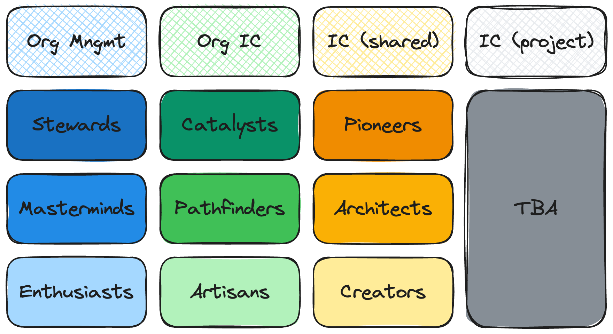

# Governance

## Introduction

This document outlines the governance structure for _**Astrolicious**_, hereafter referred to as "the Project." It defines the roles, responsibilities, and procedures for participants and outlines the process for making decisions and managing contributions.

## Mission

_**Astrolicious**_ is an independent community organization, unaffiliated with the official Astro project or its maintainers. Our mission is to harness the collective power and creativity of our community to build and maintain a suite of resources, tools, and extensions that complement and enhance the wider ecosystem surrounding Astro. By bringing together community-driven contributions, we aim to facilitate a collaborative environment where individuals can contribute, learn, and benefit from a larger pool of shared knowledge and tools. Our goal is to foster innovation, support the growth of all contributors, and create a robust foundation that enables our community to thrive alongside the evolving landscape of web development. We are committed to inclusivity, open collaboration, and the shared success of our members, independent of, yet respectful to, the Astro project and its goals.

## Role Matrix

Our role matrix exists out of four seperated paths, one being management focused while all other three are IC (individual contributer) focused. Every member of the community can get a role granted in each of the path, but only one role per path can be held at any given time.

Roles are available to **all members** of the community!

**What things do we look for in a role candidate?**

- **Being a positive member of our community** - Go above and beyond our [Code of Conduct](CODE_OF_CONDUCT.md) and commit to healthy communication across pull requests, issue discussions, Discord conversations, and any interactions outside of our community.

All Contributor roles are granted for as long as the individual wishes to engage in given role. Contributors can voluntarily also leave the project at any time. See [Retiring a Role](#retiring-a-role-alumni) below for more information. In extreme cases a role may be revoked.

Each new Role unlocks new privileges and responsibilities. Below is a summary of our role matrix.

### Organization Mngmt (Management)

#### Stewards

TBA

#### Masterminds

TBA

#### Enthusiasts

TBA

### Organization IC (Individual Contributors)

#### Catalysts

TBA

#### Pathfinders

TBA

#### Artisans

TBA

### Projects IC ( Individual Contributors)

#### Pioneers

TBA

#### Architects

TBA

#### Creators

TBA

## Retiring a Role (Alumni)

Roles are granted for as long as the person wishes to engage with the project. However, over time an active community member may choose to step away from the project to work on other things. Moving on from a project is a natural and well-understood part of any open source community, and we celebrate it!

**Alumni** is a special designation and role for any person who had once an role assigned but is now no longer actively involved. By retiring and joining Alumni you trade-in your current set of roles, privileges, and responsibilities for a new, special Alumni role (which comes with its own set of Privileges, as described above).

You can retire your role at any time and requesting Alumni status. You can initiate this action yourself if you know ahead-of-time that you need to step away from the project. Or, if you have gone several months without interacting with the community, the project may actively reach out to you to discuss retiring as a way to make room for new members.

As an Alumni member, you are still a part of the community. You may also request to have your old roles reinstated at any time through the normal process for that role.

---

Inspired by [Astro](https://github.com/withastro/.github/blob/main/GOVERNANCE.md).
